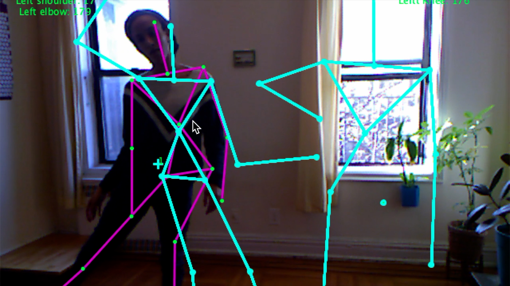
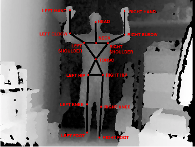

# Skeletal-loops

Uses SimpleOpenni to detect and capture 3D movement and loop it on screen.

 

# Skeleton tracking and angle detection using SimpleOpenni library

  This program map the angle of the shoulder, elbow and leg from left and right side of the body.
  
  With the serial program the Arduino could be used to activate some actuators depending of the angles
